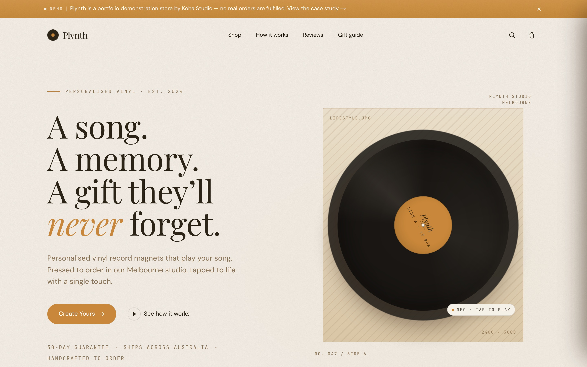

# Plynth Storefront

A headless demonstration storefront for personalised NFC vinyl-record magnets — tap one with your phone and "your song" plays — with an AI-assisted design configurator.

**Live demo →** https://plynth-storefront.vercel.app/



This is a portfolio piece. No payment is ever taken and no orders are fulfilled.

## Features

- **Four-step configurator** (search → listen → confirm → design) backed by a Redux Toolkit slice, with a live vinyl-disc preview.
- **Real music search** via a server route that proxies the iTunes Search API, returning track results and 30-second audio previews.
- **AI-assisted artwork** — a Claude (Anthropic SDK) route suggests a colour palette, style, and tagline from the chosen song, with a hard-coded fallback when no API key is set or the call fails, so the demo never breaks.
- **Hand-tuned cart drawer** — slide-over with free-shipping progress, a dismissable gift-box bundle upsell, and per-song line items that never merge.
- **Simulated checkout** — validates and confirms the order flow without taking a payment.
- **Full storefront shell** — shop and product pages, in-app case study, and policy pages (FAQ, shipping, refunds, terms, privacy, contact), plus sitemap, robots, and Open Graph image.

## Tech stack

Next.js 15 (App Router) · React 19 · Redux Toolkit · react-redux · Anthropic SDK · iTunes Search API · Tailwind CSS · TypeScript · Vercel

## Running locally

```bash
git clone https://github.com/shaandre96/plynth-storefront.git
cd plynth-storefront
npm install
cp .env.local.example .env.local   # then set ANTHROPIC_API_KEY (optional — the AI configurator falls back gracefully without it)
npm run dev
```

## Notes

Built as a portfolio piece to demonstrate a headless commerce flow end to end — third-party data (iTunes), an LLM-driven design step, and a bespoke client-side cart — while degrading gracefully when the AI key is absent. The Claude route always returns valid JSON, so a missing or failing API call quietly serves a sensible default rather than erroring.
